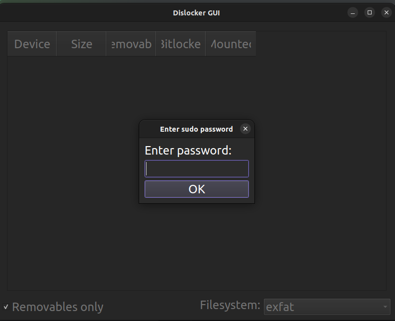
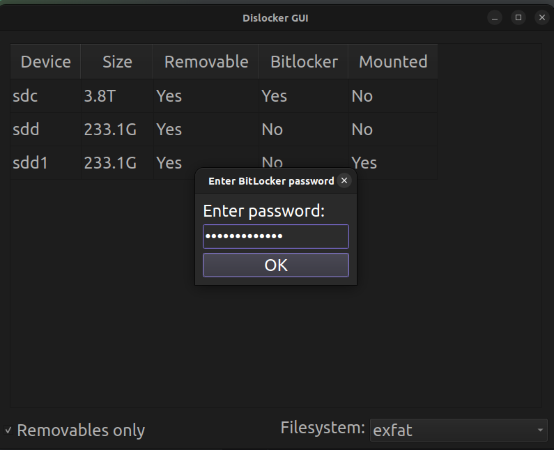
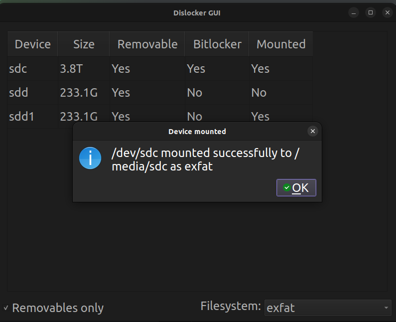
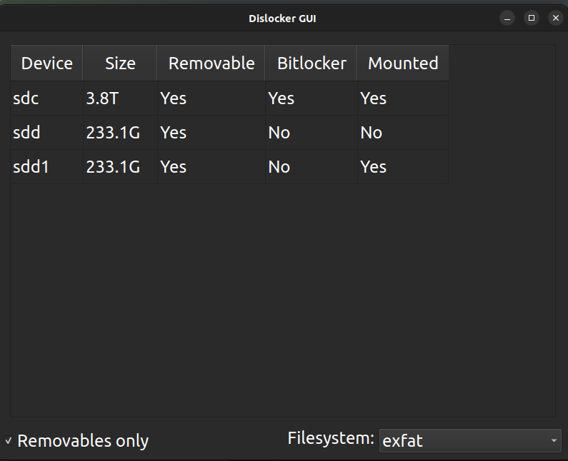
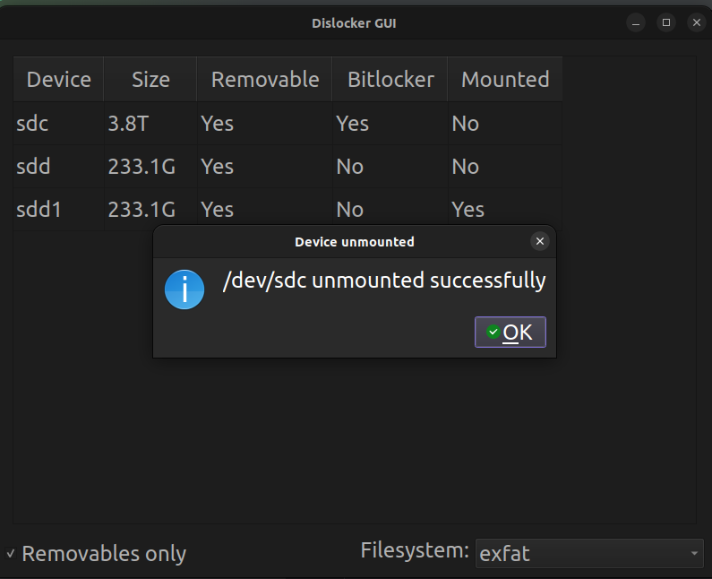

# DislockerGUI
A simple GUI for dislocker, a tool to decrypt BitLocker encrypted volumes with user passwords.

## Requirements
- Ubuntu 22.04 (probably works with other versions too, and other distros too if they have dislocker) 
  - dislocker (`sudo apt install dislocker`)
- Python 3.10 (probably works with other versions too)
  - PySide6 (`pip install PySide6~=6.7.1`)
- Sudo access

## Disclaimer
This app mounts/unmounts volumes using sudo, so it will ask for your password (incl. your Bitlocker password) when you run it, but it doesn't store anything on disk. 
It is recommended to check the code before running it, as it will run with root privileges.

Also, this app **touches your data**, it was written by a guy on the internet, so **use it at your own risk**.

There may (read: will definitely be) bugs and mistakes, so please report them if you find any.

## Installation

Run the provided `setup.sh` script to install the app.

It will generate a Python 3.10 virtual env, install the required packages, and create a `run.sh` script.

## Usage

The `run.sh` script will activate the virtual env and run the app.

Alternatively you can just run the app with `python main.py` after installing the required packages.

On startup, the app will ask for your **sudo** password, and then show a list of volumes:

Select a volume and *double click* on it to mount or unmount it, when mounting it will ask for the Bitlocker password:

The volume will be mounted at `/media/<volume_name>` with the dislocker keyfile at `/media/<volume_name>_dislocker/`.

Double click on the mounted volume again to unmount it.

